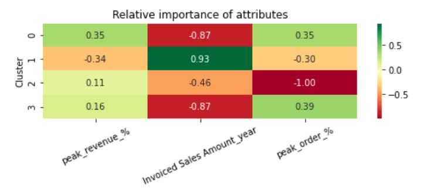

# ReDI_k-means-clustering
Customer Segmentation with k-means clustering. 
Final project for the ReDI course *Data Analytics with Python*.

# Content Description
Source data was donated by agricultural company ProOrganica Ltd. (2022)
Source data contains columns: Customer, Revenue 2022, Order lines count 2022, Revenue at the season peak, Order lines count at the season peak

## Data Anonymization
Customer data anonymized by hashing: hashlib.sha256(str(customer).encode()).hexdigest()[:10]
Alternatively, trimming the data to certain values.

## Data Exploraction
.isna() , .discribe() , .min() , .max()
Visual exploration:

## Data Transformation
* .fillna(0.01) to avoid zero
* .replace(0, 0.01) replace zero for later log transformation, otherwise will et inf
* replace negative values by 0.01 as well
* round(data, 2)

## Feature Ing.
* Feature 1: Revenue Year
* Feature 2: Peak revenue share in % (further “peak_revenue_%”)
* Feature 3: Peak order lines count share in % (further “peak_order_%”)
* Additional: $ per Order Line Year and $ per Order Line Peak

## K Means Clustering k = 4

Comparing Clusters / Customer Behavior based on Peak Revenue % vs Peak Order %

Comparing Clusters based on Revenue Year vs Revenue Peak (absolute values)

## Imports and Dependencies

    * pandas
    * os
    * re
    * xlsxwriter
    * openpyxl
    * datetime, timedelta, date
    * numpy
    * webbrowser
    * pathlib Path
    * matplotlib ticker, pyplot
    * seaborn
    * hashlib
    * sklearn.cluster KMeans
    * sklearn.preprocessing StandardScaler
    
## Output file
.xlsx file with 4 spreadsheets for each cluster.
Columns: 
* Customer 	Invoiced Sales Amount_year 	
* Invoiced Sales Amount_peak 	
* Sales Order Lines Count_year 	
* Sales Order Lines Count_peak 	
* peak_order_% 	
* peak_revenue_% 	
* Cluster 	
* $_per_line_year 	
* $_per_line_peak
