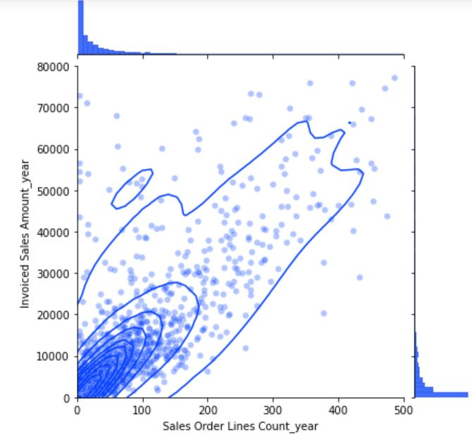

# ReDI_k-means-clustering
Customer Segmentation with k-means clustering. Final project for the ReDI course *Data Analytics with Python*.

# Content Description
Source data was donated by agricultural company ProOrganica Ltd.
Source data contains columns: Customer, Revenue 2022, Order lines count 2022, Revenue at the season peak, Order lines count at the season peak

## Data Anonymization
Customer data anonymized by hashing: hashlib.sha256(str(customer).encode()).hexdigest()[:10]
Alternatively, trimming the data to certain values.

## Data Exploraction
.isna() , .discribe() , .min() , .max()
Visual exploration:

